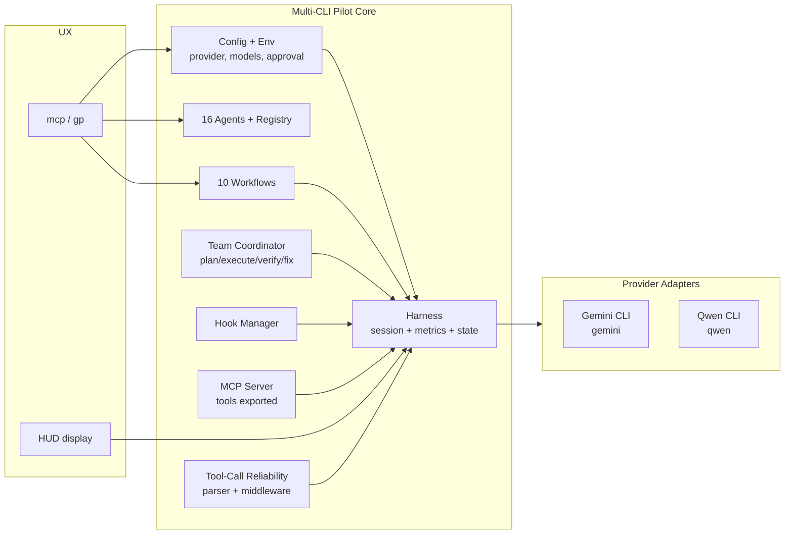

[English](README.md) | [한국어](README.ko.md)

# Multi-CLI Pilot

**하나의 오케스트레이션 하네스로 여러 코딩 에이전트 CLI를 조종합니다.**
[Gemini CLI](https://github.com/google-gemini/gemini-cli)와
[Qwen CLI](https://github.com/QwenLM/qwen-code)를 동일한 에이전트,
워크플로우, 프롬프트, 훅, MCP, 팀 런타임으로 다룰 수 있습니다.

> Multi-CLI Pilot은 기존 `gemini-pilot`과 `qwen-pilot`의 후속 저장소입니다.
> 두 저장소는 여기로 통합되었으며, 기존 `gp` / `gemini-pilot` 명령과
> `GeminiPilotConfig` 타입 별칭은 하위 호환을 위해 유지됩니다.

## 왜 필요한가

코딩 에이전트 CLI는 빠르게 쏟아지지만 각자 전용 에이전트, 워크플로우,
tmux 스크립트를 따로 관리하게 됩니다. Multi-CLI Pilot은 **Provider
어댑터**로 CLI를 추상화해, 어떤 CLI를 쓰더라도 하네스·HUD·MCP 서버·
Tool-call 신뢰성 파이프라인이 그대로 동작합니다.

## 아키텍처



## 주요 기능

- **16개 전문 에이전트** — 아키텍트, 실행자, 디버거, 리뷰어, 테스트 엔지니어 등.
- **10개 내장 워크플로우** — autopilot, deep-plan, sprint, investigate, tdd, architecture-cycle, refactor, deploy-prep, clarification, team-sync.
- **Provider 어댑터** — config나 환경변수로 `gemini` / `qwen` 전환. 바이너리·기본 모델·설치 안내가 자동으로 교체됩니다.
- **팀 협업 런타임** — Plan → Execute → Verify → Fix 파이프라인과 품질 게이트.
- **세션 메트릭** — 프롬프트 수, 예상 토큰, 지연 샘플, 벽시계 경과를 세션 상태에 영속화.
- **Tool-call 신뢰성** — Provider 무관하게 tool-call 출력을 견고화하는 파서와 미들웨어.
- **훅 시스템** — session-start, session-end, error 등 이벤트 기반 확장.
- **MCP 서버** — Model Context Protocol을 통해 외부 MCP 클라이언트에서 하네스 제어.
- **HUD 대시보드** — tmux 연동 실시간 메트릭 표시.
- **상태 영속화** — JSON 기반 상태·메모리·노트패드. 하위 호환을 위해 디렉터리 이름은 `.gemini-pilot/`로 유지.

## 설치

### macOS
1. 이 저장소를 클론하거나 다운로드합니다
2. `Install-Mac.command`를 더블클릭합니다
3. 터미널에서 `mcp --help`(또는 기존 `gp --help`) 실행

### Windows
1. 이 저장소를 클론하거나 다운로드합니다
2. `Install-Windows.bat`를 더블클릭합니다
3. CMD에서 `mcp --help` 실행

### Linux
```bash
git clone https://github.com/KIM3310/multi-cli-pilot.git
cd multi-cli-pilot
chmod +x Install-Linux.sh && ./Install-Linux.sh
```

### npm
```bash
npm install -g multi-cli-pilot
```

### 요구 사항

- Node.js ≥ 20.0.0
- 아래 CLI 중 하나가 `$PATH`에 있어야 합니다:
  - **Gemini** — `npm install -g @google/gemini-cli` (기본, `gemini-3.1-pro` 계열)
  - **Qwen** — `npm install -g @qwen-code/qwen-code` (`qwen3-coder-plus` 계열)

## 빠른 시작

```bash
# 기본 Provider(Gemini)로 실행
mcp

# 이번 세션만 Qwen 사용
MCP_PROVIDER=qwen mcp

# 기존 별칭도 그대로 동작
gp
gemini-pilot
```

## Provider 선택 규칙

다음 순서로 처음 발견되는 설정을 사용합니다.

1. `MCP_PROVIDER` (혹은 기존 `GP_PROVIDER`) 환경변수
2. 프로젝트 설정 `.gemini-pilot/config.json`의 `provider`
3. 사용자 설정 `~/.config/gemini-pilot/config.json`의 `provider`
4. 내장 기본값 (`gemini`)

프로젝트 설정 예시:

```jsonc
{
  "provider": "qwen",
  "session": { "approvalMode": "auto", "defaultTier": "balanced" }
}
```

`provider`를 `qwen`으로 바꾸고 `models.*`를 직접 지정하지 않았다면,
로더가 Qwen 기본 모델(`qwen3-coder-plus`/`qwen3-coder`/`qwen3-coder-flash`)로
자동 교체합니다.

## 명령어

| 명령어 | 설명 |
|---|---|
| `mcp init` | `.gemini-pilot/` 스캐폴드 생성 |
| `mcp` | 활성 Provider로 인터랙티브 세션 시작 |
| `mcp config show` | 해석된 설정 출력 |
| `mcp workflows list` | 사용 가능한 워크플로우 목록 |
| `mcp workflows run <name>` | 워크플로우 실행 |
| `mcp agents list` | 등록된 에이전트 목록 |
| `mcp team` | tmux 기반 멀티 에이전트 팀 시작 |

## 하위 호환성

- `gp` / `gemini-pilot` 바이너리 이름이 그대로 유지됩니다.
- `GeminiPilotConfig` / `GeminiPilotConfigSchema`는 신규
  `MultiCliPilotConfig` / `MultiCliPilotConfigSchema`에 대한
  deprecated 별칭으로 유지됩니다.
- 상태 디렉터리는 여전히 `.gemini-pilot/`이라 기존 프로젝트는 마이그레이션이 필요 없습니다.

## 개발

```bash
npm install
npm run typecheck      # strict TypeScript
npm test               # config, harness, team, MCP 등 225개 테스트
npm run lint           # biome
npm run build          # dist/로 빌드
```

## 라이선스

MIT — [LICENSE](LICENSE) 참조.
