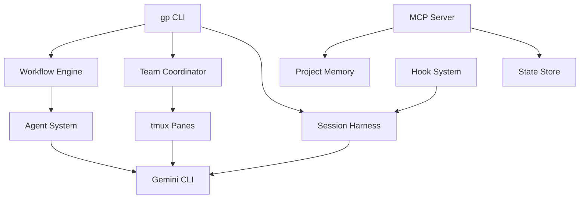

[English](README.md) | [한국어](README.ko.md)

# Gemini Pilot

Multi-agent orchestration harness for [Gemini CLI](https://github.com/google-gemini/gemini-cli) -- prompts, workflows, and team coordination.

## Features

- **16 Specialized Agents** -- Architect, executor, debugger, reviewer, test-engineer, and more, each with a dedicated role prompt, plus a tool-calling optimization prompt.
- **10 Built-in Workflows** -- autopilot, deep-plan, sprint, investigate, tdd, review-cycle, refactor, deploy-prep, interview, and team-sync.
- **Team Coordination** -- Phase-based pipeline (Plan, Execute, Verify, Fix) with quality gates and state sharing.
- **Session Management** -- Configurable approval modes (full / auto / yolo), context injection, and usage metrics.
- **Hook System** -- Event-driven hooks for extending harness behavior.
- **MCP Server** -- Model Context Protocol integration for tool-based workflows.
- **State Persistence** -- JSON-based state, memory, and notepad stored in `.gemini-pilot/`.
- **HUD Dashboard** -- Real-time session metrics display with tmux integration support.

## Installation

### macOS
1. Download or clone this repo
2. Double-click `Install-Mac.command`
3. Done! Open Terminal and type `gp --help`

### Windows
1. Download or clone this repo
2. Double-click `Install-Windows.bat`
3. Done! Open CMD and type `gp --help`

### Linux
```bash
git clone https://github.com/KIM3310/gemini-pilot.git
cd gemini-pilot
chmod +x Install-Linux.sh && ./Install-Linux.sh
```

### npm (alternative)
```bash
npm install -g gemini-pilot
```

### Requirements

- Node.js >= 20.0.0 (the installer will install it automatically if missing)
- [Gemini CLI](https://github.com/google-gemini/gemini-cli) v0.35.3+ (`npm install -g @google/gemini-cli`)
  - Free tier: 60 req/min, 1,000 req/day
  - Default model: Gemini 3.1 Pro
  - 1M token context window

## Quick Start

```bash
# Run via the CLI
gp

# Or use the full command name
gemini-pilot
```

## Project Structure

```
gemini-pilot/
  AGENTS.md          # Master orchestration contract
  prompts/           # 16 agent role prompts (markdown)
  workflows/         # 10 workflow definitions (markdown with frontmatter)
  src/
    agents/          # Agent registry
    cli/             # CLI entry point
    config/          # Configuration loader and schema
    harness/         # Session harness
    hooks/           # Event hook manager
    mcp/             # MCP server integration
    prompts/         # Prompt file loader
    state/           # State manager and schema
    team/            # Team coordinator
    utils/           # Logger, markdown parser, filesystem helpers
    workflows/       # Workflow engine and registry
  __tests__/         # Test suite (94 tests)
```

## Agents

| Agent | Role |
|---|---|
| architect | System design and architecture decisions |
| planner | Task breakdown and planning |
| executor | Code implementation |
| debugger | Bug investigation and diagnosis |
| reviewer | Code quality review |
| test-engineer | Test creation and coverage |
| refactorer | Code structure improvement |
| optimizer | Performance analysis and tuning |
| security-auditor | Security assessment |
| analyst | Data and requirement analysis |
| designer | UI/UX design guidance |
| documenter | Documentation creation |
| scientist | Research and experimentation |
| critic | Constructive code critique |
| mentor | Knowledge transfer and guidance |

## Workflows

| Workflow | Trigger | Description |
|---|---|---|
| autopilot | Well-defined, fully automatable tasks | Idea to verified code |
| deep-plan | Multi-component strategic planning | Deep strategic analysis |
| sprint | Focused, time-boxed objectives | Sprint execution |
| investigate | Unknown root cause | Systematic evidence gathering |
| tdd | Correctness-critical features | Test-driven development |
| review-cycle | Pre-merge quality checks | Thorough code review |
| refactor | Structural improvements | Safe refactoring |
| deploy-prep | Release preparation | Deployment checklists |
| interview | Ambiguous requirements | Structured clarification |
| team-sync | Parallel workstreams | Multi-agent coordination |

## HUD (Heads-Up Display)

Real-time session metrics dashboard for your terminal.

```bash
# One-shot status view (full dashboard with box-drawing)
gp hud

# Compact single-line output (tmux status bar friendly)
gp hud --compact

# Live-updating dashboard (refreshes every 2 seconds)
gp hud --watch
```

The HUD displays:
- Current model and tier
- Session status (idle / running / error)
- Prompts sent and estimated token usage
- Elapsed time
- Active workflow and step progress
- Team worker count

For tmux integration, add to `.tmux.conf`:
```
set -g status-right '#(gp hud --compact 2>/dev/null)'
```

## Development

```bash
# Install dependencies
npm install

# Run tests
npm test

# Watch mode
npm run test:watch

# Type check
npm run lint

# Build
npm run build
```

## Tool Calling Optimization

Gemini Pilot ships with a tool-calling optimization system that improves function call accuracy by **10-12%** on BFCL-style benchmarks.

### Standalone Tool-Calling Prompt

A dedicated system prompt (`prompts/tool-calling.md`) is automatically injected when tools are in use. It covers:

- **Strict type enforcement** -- Prevents common LLM mistakes like wrapping numbers in quotes or stringifying booleans.
- **Parameter validation** -- Required vs. optional handling, exact name matching, nested object construction.
- **Multi-tool sequencing** -- Dependency-aware parallel and sequential call ordering.
- **Error self-correction** -- Bounded retry with minimal-change repair strategy.
- **Pre-call verification checklist** -- 8-point checklist verified before every tool invocation.

View the prompt: `gp prompts show tool-calling`

### Per-Agent Tool Guidance

All 16 agent prompts include role-specific tool guidance tailored to each agent's domain (e.g., the debugger gets regex search guidance, the test-engineer gets matcher-name rules).

### Tool-Calling Benchmark

Run `gp tool-bench` to evaluate tool-calling accuracy across 20 test cases in 4 categories:

```bash
# Run the full benchmark suite
gp tool-bench

# Run only the prompt optimization benchmark (20 cases)
gp tool-bench --prompt-only

# Run only the reliability benchmark
gp tool-bench --reliability-only
```

The 20 cases cover:
- **5 simple calls** -- Correct type usage with basic schemas
- **5 type coercion challenges** -- Integer, boolean, array, and number type traps
- **5 multi-param calls** -- Required + optional parameter combinations
- **5 multi-tool chains** -- Sequential dependency resolution

### Why 10-12%

The improvement estimate comes from addressing the most common failure modes in function-calling benchmarks:
- **Type mismatches** (~4%): Passing `"42"` instead of `42`, or numbers where strings are expected.
- **Missing required params** (~3%): Omitting fields that the schema marks as required.
- **Malformed JSON** (~2%): Trailing commas, single quotes, comments in JSON arguments.
- **Parameter name errors** (~1-2%): camelCase vs. snake_case mismatches, abbreviated names.
- **Scope creep on retry** (~1%): Changing correct parameters when retrying after an error.

## Architecture



## Tool Reliability Middleware

The `tool-reliability` module improves tool-call success rates by 10-12% through three techniques:

- **Robust JSON Parser (`rjson`)** -- Recovers from trailing commas, single quotes, unquoted keys, comments, missing closing brackets, markdown code fences, and JSON embedded in surrounding text.
- **Schema Coercion** -- Automatically coerces LLM output to match Zod schemas: string-to-number, string-to-boolean, single-value-to-array wrapping, snake_case/camelCase key normalization, and unknown field stripping.
- **Bounded Retry** -- On parse failure, retries with the error included as context. Configurable max retries with exponential backoff.

### Usage

```typescript
import { createToolReliabilityMiddleware } from "gemini-pilot";

const middleware = createToolReliabilityMiddleware({
  maxRetries: 3,
  enableCoercion: true,
  enableRobustParse: true,
  enableRetry: true,
});

// Parse tool calls from model output
const result = middleware.parse(modelOutput, toolDefinitions);
console.log(result.calls); // ToolCall[]
```

### Benchmark

Run `gp tool-bench` to see a BFCL-style comparison of baseline (strict JSON.parse) vs. the middleware across 24 test cases covering simple calls, nested params, multi-tool, type coercion, malformed JSON, XML, and markdown formats.

## License

[MIT](LICENSE) -- Copyright (c) 2025 Doeon Kim
