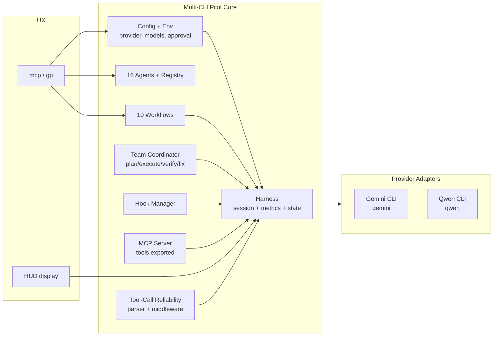

[English](README.md) | [한국어](README.ko.md)

# Multi-CLI Pilot

**One orchestration harness, multiple coding-agent CLIs.** Drive
[Gemini CLI](https://github.com/google-gemini/gemini-cli) or
[Qwen CLI](https://github.com/QwenLM/qwen-code) from the same agents,
workflows, prompts, hooks, MCP tools, and team primitives.

> Multi-CLI Pilot is the successor to `gemini-pilot` and `qwen-pilot`.
> Both repos have been consolidated here and the Gemini-only APIs are
> preserved as deprecated aliases — existing `gp` / `gemini-pilot`
> commands continue to work.

## Product and Review Surface

A multi-agent CLI harness that shows how complex coding work can be coordinated without losing traceability.

| Lens | Definition |
|---|---|
| Buyer or user | Engineering teams, automation leads, and internal platform groups experimenting with agent-assisted development. |
| Commercial route | Sell as an internal workflow setup, team-agent playbook, or MCP-enabled orchestration starter. |
| Review signal | Prompt management, workflows, coordination, task queues, and MCP support in a reviewable CLI surface. |
| Safety boundary | Agent output remains advisory and review-required; production repositories should keep human approval and CI gates. |
| Fast proof | Run the local test/build scripts and inspect the workflow examples and coordination docs. |

## Why

Coding-agent CLIs ship fast but each one ends up with its own agents,
workflows, and tmux scripts. Multi-CLI Pilot abstracts the CLI behind
a **provider adapter** so the harness, HUD, MCP server, and tool-
reliability pipeline stay the same regardless of which CLI you target.

## Architecture



## Features

- **16 Specialized Agents** — architect, executor, debugger, reviewer, test-engineer, and more, each with a role prompt plus a tool-calling optimization prompt.
- **10 Built-in Workflows** — autopilot, deep-plan, sprint, investigate, tdd, review-cycle, refactor, deploy-prep, interview, team-sync.
- **Provider Adapter** — pick `gemini` or `qwen` via config or env. Swapping providers swaps the binary, default models, and install instructions.
- **Team Coordination** — phase-based pipeline (Plan → Execute → Verify → Fix) with quality gates and shared state.
- **Session Metrics** — prompts sent, estimated tokens, latency samples, wall-clock elapsed — persisted to session state.
- **Tool-Call Reliability** — parser and middleware for hardening tool-call output across providers.
- **Hook System** — event-driven hooks for extending harness behavior (session-start, session-end, error, …).
- **MCP Server** — Model Context Protocol integration so the harness can be driven from any MCP-aware client.
- **HUD Dashboard** — real-time metrics display with tmux integration.
- **State Persistence** — JSON state, memory, and notepad stored in `.gemini-pilot/` (directory name kept for backward compatibility).

## Installation

### macOS
1. Download or clone this repo
2. Double-click `Install-Mac.command`
3. Open Terminal and type `mcp --help` (or the legacy `gp --help`)

### Windows
1. Download or clone this repo
2. Double-click `Install-Windows.bat`
3. Open CMD and type `mcp --help`

### Linux
```bash
git clone https://github.com/KIM3310/multi-cli-pilot.git
cd multi-cli-pilot
chmod +x Install-Linux.sh && ./Install-Linux.sh
```

### npm
```bash
npm install -g multi-cli-pilot
```

### Requirements

- Node.js ≥ 20.0.0
- One of the supported coding-agent CLIs on `$PATH`:
  - **Gemini** — `npm install -g @google/gemini-cli` (default, `gemini-3.1-pro` family)
  - **Qwen** — `npm install -g @qwen-code/qwen-code` (`qwen3-coder-plus` family)

## Quick Start

```bash
# Run with the default provider (Gemini)
mcp

# Switch to Qwen for the current session
MCP_PROVIDER=qwen mcp

# Legacy aliases still work
gp
gemini-pilot
```

## Provider Selection

The provider is resolved from the first matching source:

1. `MCP_PROVIDER` (or the legacy `GP_PROVIDER`) environment variable
2. `provider` field in `.gemini-pilot/config.json` (project)
3. `provider` field in `~/.config/gemini-pilot/config.json` (user)
4. Built-in default (`gemini`)

Example project config:

```jsonc
{
  "provider": "qwen",
  "session": { "approvalMode": "auto", "defaultTier": "balanced" }
}
```

When `provider` is set to `qwen` and `models.*` entries have not been
overridden, the loader substitutes Qwen tier defaults
(`qwen3-coder-plus` / `qwen3-coder` / `qwen3-coder-flash`)
automatically.

## Project Structure

```
multi-cli-pilot/
  AGENTS.md           # Master orchestration contract
  prompts/            # 16 agent role prompts (markdown)
  workflows/          # 10 workflow definitions (markdown with frontmatter)
  src/
    agents/           # Agent registry
    benchmark/        # Benchmark runner
    cli/              # CLI entry point
    config/           # Config loader, schema, provider resolution
    errors/           # Error codes
    harness/          # Session harness (provider-aware)
    hooks/            # Event hook manager
    hud/              # HUD renderer
    init/             # `mcp init` templates
    mcp/              # MCP server integration
    metrics/          # Runtime session metrics tracker
    plugins/          # Prompt/workflow plugin loader
    prompts/          # Prompt file loader
    providers/        # Provider adapter layer (Gemini, Qwen)
    state/            # State manager and schema
    team/             # Team coordinator (plan/execute/verify/fix)
    tool-bench/       # Tool-calling benchmark harness
    tool-reliability/ # Tool-call parser + middleware
    utils/            # fs, logger, small helpers
    workflows/        # Workflow runner
  __tests__/          # Vitest test suite (225 tests)
```

## Commands

| Command | Description |
|---|---|
| `mcp init` | Scaffold `.gemini-pilot/` with config, memory, workflows |
| `mcp` | Launch an interactive session with the active provider |
| `mcp config show` | Print the resolved configuration |
| `mcp workflows list` | List available workflows |
| `mcp workflows run <name>` | Execute a workflow end-to-end |
| `mcp agents list` | List registered agents |
| `mcp team` | Start a tmux-based multi-agent team |

## Backward Compatibility

- The published binary names `gp` and `gemini-pilot` continue to work.
- Existing imports of `GeminiPilotConfig` / `GeminiPilotConfigSchema`
  are retained as deprecated type aliases pointing at the new
  `MultiCliPilotConfig` / `MultiCliPilotConfigSchema` names.
- The state directory is still `.gemini-pilot/` so existing projects
  don't need to migrate anything.

## Development

```bash
npm install
npm run typecheck      # strict TypeScript
npm test               # 225 tests across config, harness, team, MCP, …
npm run lint           # biome
npm run build          # emit to dist/
```

## License

MIT — see [LICENSE](LICENSE).

## Cloud + AI Architecture

This repository includes a neutral cloud and AI engineering blueprint that maps the current proof surface to runtime boundaries, data contracts, model-risk controls, deployment posture, and validation hooks.

- [Cloud + AI architecture blueprint](docs/cloud-ai-architecture.md)
- [Machine-readable architecture manifest](docs/architecture/blueprint.json)
- Validation command: `python3 scripts/validate_architecture_blueprint.py`
